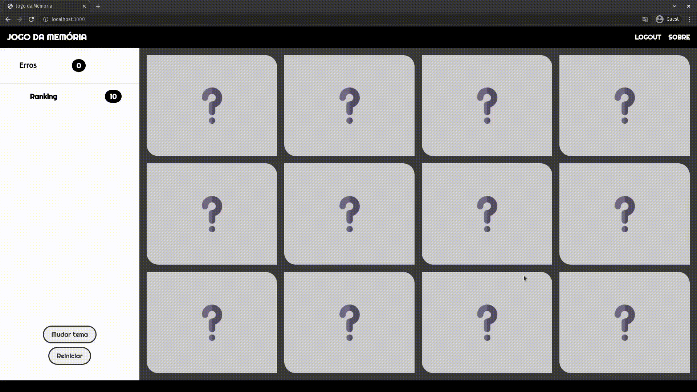
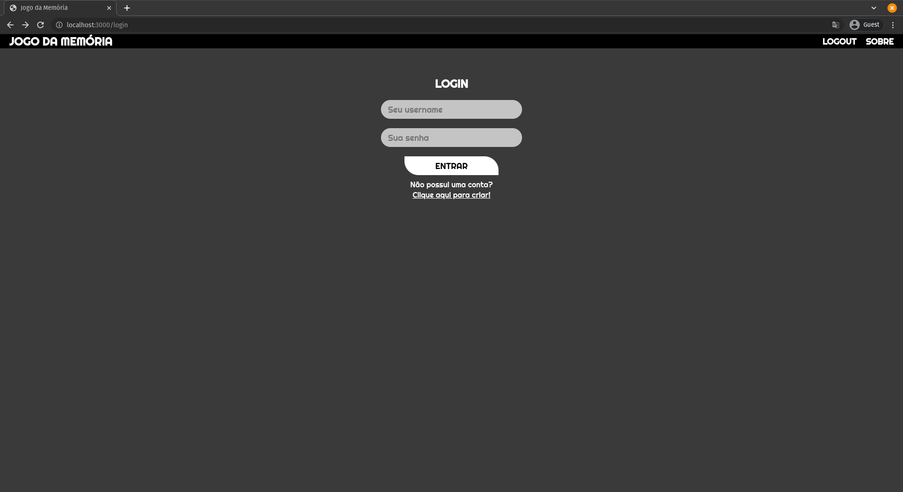
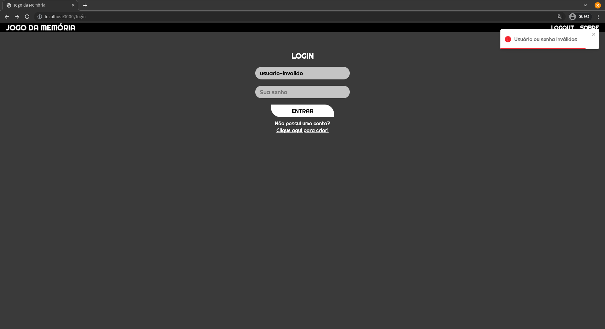

# 5PJS-ativ-games

Projeto proposto pelo professor Ricardo Marciano na disciplina de 5PJS na FAETERJ-Rio.

Desenvolvido em conjunto com [Andressa Silva](https://github.com/AuroraDark), o projeto consiste em um jogo da memória com comunicação cliente-servidor, onde a configuração do jogo (posição das cartas, etc) ficam presentes no servidor enquanto o cliente faz requisições Ajax para obter as informações.

## Imagens

### Jogo

- Sempre que uma carta é selecionada é enviada uma requisição Ajax para o servidor, que retorna a identificação da carta.

### Login

## Tecnologias usadas no Frontend
 - Javascript
 - React
 - Styled Components
 - Redux Saga
 - Redux Persist
 - Ajax (axios)

## Iniciar o aplicativo
    # clona o repositório
    git clone https://github.com/vitormcferreira/5PJS-ativ-games-frontend.git

    # entra na pasta do repositório
    cd 5PJS-ativ-games-frontend

    # inicia o ambiente virtual e instala as dependências
    npm i

    # inicia o servidor (demora um pouco)
    npm start
